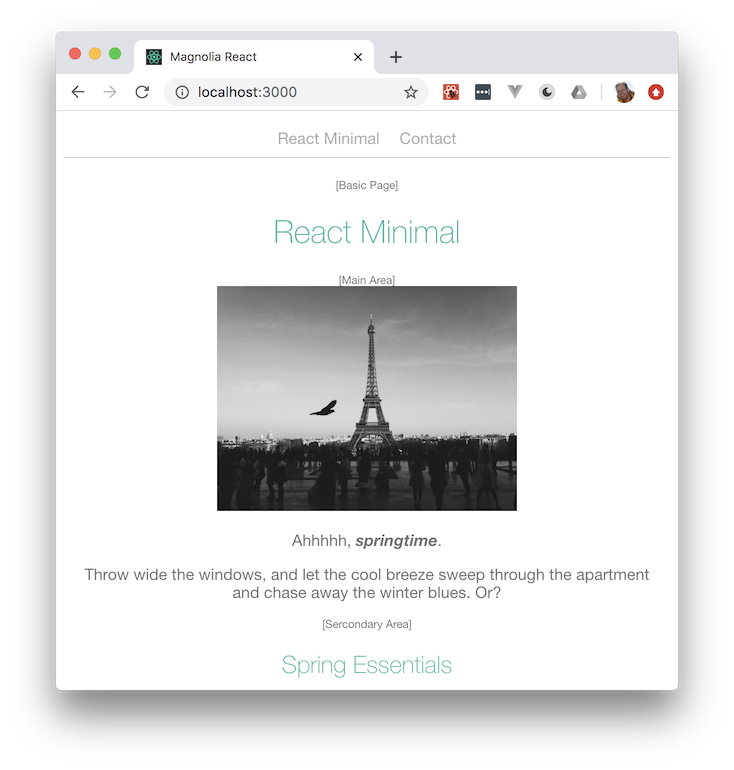

# Cloud Page Headless Demo

The Visual SPA Editor allows authors to edit your headless frontend, reducing your ongoing maintenance duties. (win!) But you get to keep everything fully headless.

This demo shows you how to use the basic features for Vue, React & Angular.

## Features

The demo contains:

Pages
- Basic
- Contact

Components
- Header 
- Paragraph 
- Image 
- List 
- Item  (available inside List component)
- Expander 

- Navigation 

Features
 - Multilanguage support
 - Theme support

# Build your frontend

### Vue

Go to `/frontend/vue-minimal` on the terminal and run `npm install`, and then `npm run build`.

See the `.env` files for important configurations.

### React

Go to `/frontend/react-minimal` on the terminal and run `npm install`, and then `npm run build:mgnl`.

See the `.env` files for important configurations.

### Angular

Go to `/frontend/angular-minimal` on the terminal and run `npm install`, and then `npm run build`.
(TODO: change defult build directory. Now it deploys into the `light-modules/angular-minimal-lm/webresources`)

See the files in `/src/environments` for important configurations.

# Deploy your frontend 

In order to use the Magnolia Pages App - your frontend must be deployed.

## Deploy locally, or to the web

You can connect your Magnolia instance to your local development environment.

For production, deploy your SPA wherever you choose (S3, netlify, vercel, etc).

Once deployed, configure your Magnolia pages to point to the url of your frontend (which might be your `localhost`).

Set the `templateScript` to your URL in the YAML files in these locations:
* `light-modules/vue-minimal-lm/templates/pages`
* `light-modules/react-minimal-lm/templates/pages`
* `light-modules/angular-minimal-lm/templates/pages`

## Deploy to Magnolia instance

It is possible to host your frontend on your Magnolia instance. This is convenient, but does not support cases using SSR or SSG like Next.js, Gatsby, etc.

See tips here `_dev/README-hosting-in-magnolia.md`

## Running your frontend locally in development mode

### Vue

Start the headless Vue application inside `/frontend/vue-minimal` by running `npm run serve`.

### React

Start the headless React application inside `/frontend/react-minimal` by running `npm start`.

### Angular

Start the headless Angular application inside `/frontend/angular-minimal` by running `ng serve`.

# Additional Information

## Configuring DAM security

### DAM

In order for images to be displayed:
Open the Security app, open the `Roles` tab, edit the `anonymous` role, go to `Web access` tab, `Add new` with this path `/dam/*` set to GET.

## Security set up

### Content endpoint permissions

The app has anonymous access to Magnolia REST endpoints with no additional configuration because:

- "Web access" is allowed, because the restEndpoint files are under the `/delivery` path
- "Access contol list" access is allowed, beause the restEndponts have the `bypassWorkspaceAcls` property.

**NOTE** Allowing anonymous access may not be suitable for a production environment where you wish to keep data private.

### Template Annotations Endpoint

If you want to debug the editing features when running the app outside of the Magnolia page editor, you will want permissions to the template-annotations endpoint:

Open the Security app, open the Roles tab, edit the `rest-anonymous` role, go to `Web access` tab, `Add new` with this path `/.rest/template-annotations*` set to GET.

(Perform similar steps if you would like to use the `template-annotations` endpoint.)
